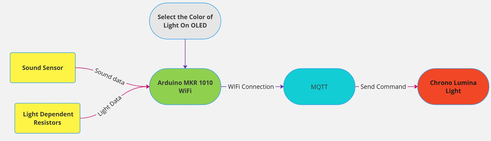
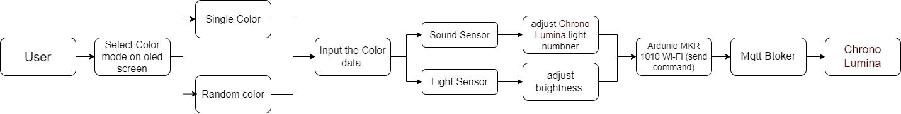

# SoundDancing
  
An Arduino-based project designed to create a sound-reactive and light-reactive to control remotely Chrono Lumina through sound sensor, LDR, NeoPixel and MQTT.     
This project is the Assignment for **CASA0014 Connected Environments**. 

## Project Status 🚧

This project is currently under development. Major features are being implemented, and some functionalities are still in progress.

---

## Table of Contents 📂

- [Background and Introduction](#background-and-introduction-)
- [Features](#features-)
- [Hardware and Components](#hardware-and-components-)
- [Software and Libraries](#software-and-libraries-)
- [Progress and Roadmap](#progress-and-roadmap-)
- [License](#license-)

---

## Background and Introduction 🌟

    

 
   
Welcome to the **SoundDancing** project! This idea is inspired by my own rhythm lights and my strong interest in the fusion of sound and light and shadow. In my previous projects, I designed a smart devices based on environmental data, the learning assistants that monitor the learning environment and sound playback systems. This made me realize that sound can not only be heard, but can also be "seen" in a more intuitive way. So, I would like to develop the soundDancing to achieve the sound visualization.   

Through the spectral analysis and rhythm extraction of environmental sounds, the **SoundDancing** is driven by an optimized algorithm to present diverse lighting patterns, enabling it to adapt to different sound scenarios (such as music, ambient sounds, or speech). This project not only embodies the cross-domain connection between sound and vision but also offers novel ideas for the research and design of interactive intelligent devices.

---

## Features ✨

- [x] **Light Monitoring**: Detect environmental light levels using a light sensor to adjust the brightness of Chrono Lumina Light.
- [x] **Sound Detection**: Detect environmental sound using a microphone sensor to collect sound data, and using these data to control remotely the Chrono Lumina Light.
- [x] **OLED Screen Display**: Display the option to the user to select the color mode (Single Mode and Random Color Mode).
- [x] **Wi-Fi Connectivity**: Transmit data remotely using the MKR 1010 WiFi board, control the Chrono Lumina Light remotely.
- [ ] **Sound Processing**: Find a way to avoid the noise and other elements, which will influence the sound data **(Doing now)**
- [ ] **User Alerts**: Provide a rotary encoder to let user can choose the color mode on the screen. **(Waiting to combine)**

---

## Hardware and Components 🔧

- **Arduino Board**: Arduino MKR 1010 WiFi
- **Sensors**: Light sensor, microphone sensor
- **Display**: OLED Screen
- **Actuators**: Rotary encoder

---

## Software and Libraries 🛠

- **IDE**: 
    - `Arduino IDE`
- **Libraries**: 
    - `Adafruit_GFX` 
    - `WiFiNINA`
    - `Wire`
    - `Adafruit_SSD1306`
    - `WiFiNINA`
    - `PubSubClient`
    - Continue... future update
---

## Progress and Roadmap 🗓

### Current Progress:
- [x] Light sensor test
- [x] Sound sensor test
- [x] OLED screen test
- [x] MQTT connection test and public messages to topic test
- [x] Rotary encoder test
- [x] Combine the OLED screen and rotary encoder together to achieve the selection function
- [x] Combine the Light sensor and Sound sensor to control the Chrono Lumina Light remotely and released the first version of project. Control the one Chrono Lumina Light.
- [ ] **(Doing)** During the test processing, found the noise will influence the sound data collection. It need to a way to avoid this issue. Now, find two ways:   
**1.** Use the sample windows to calculate the average data  (on software part)   
**2.** Develop a filter to filter the noise (on hardware part)
#### Current status

##### Circuit Diagram

##### Work Flow

-  Sound Sensor     
     - Based on the sound level from sound sensor to turn on different number led of neopixel (sound level (0 - 1023) map to leds number (0 - 12))
        - the sound level is equal or greater than 200 the led color is white
        - the sound level is greater than 200 and  equal or smaller than 400 the led color is green
        - the sound level is greater than 400 and  equal or smaller than 600 the led color is blue
        - the sound level is greater than 600 and  equal or smaller than 800 the led color is yellow
        - the color of the other sound level is red
     - Based on the light level from LDR to adjust the brightness of the LED
        - light level (0 - 1023) map to brightness value(0 - 120)

### Next Steps:

- [ ] Combine the OLED screen and Rotary encoder to the main project  
- [ ] Develop the filter, such as the low pass filter, and using FFT to ensure the sound data clean
- [ ] Optimized encloser 
- [ ] Control more Chrono Lumina Lights, not only one
- [ ] Future updating

##### Future expectation

---

## License 📜
   
This project is licensed under the [MIT License](LICENSE).
